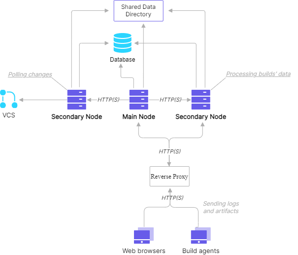
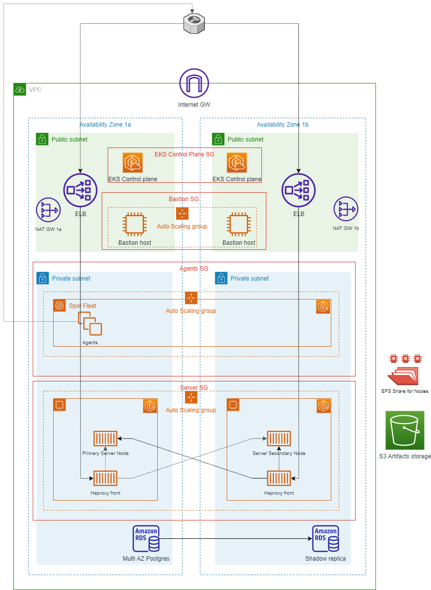
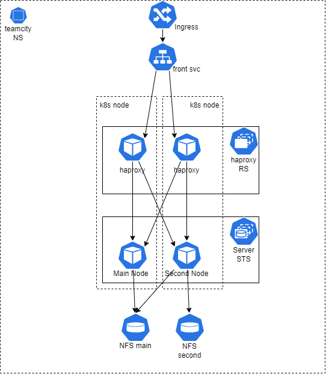

# Teamcity on EKS

## Teamcity multinode architecture
According to the documentation https://www.jetbrains.com/help/teamcity/multinode-setup.html we have the next architecture

## Infrastructure architecture
The infrastructure sets up the following:
- A highly available architecture that spans two Availability Zones
- A VPC configured with public and private subnets, according to AWS best practices, to provide you with your own virtual network on AWS
- In the public subnets, managed NAT gateways to allow outbound internet access for resources in the private subnets
- In every public subnet, a Linux bastion host in an Auto Scaling group to allow inbound Secure Shell (SSH) access to Amazon Elastic Compute Cloud (Amazon EC2) instances in private subnets
- An Amazon EKS cluster, which creates the Kubernetes control plane
- In the private subnets, two autoscale groups of Kubernetes nodes. One for Nodes with guaranted power. And second for agents on spot fleet.
- Multi AZ Postgresql instance
- EFS share for nodes data storage
- S3 bucket for build artifacts

## Environment architecture

## Out of the scope
- graphics and alerts
- log shipping
- backups
- DRP and other instructions and documentation
- ci/cd pipelines